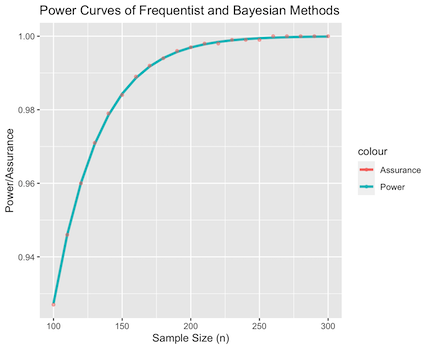
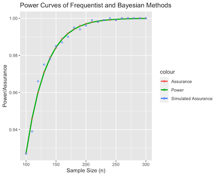

<style type="text/css">

body{ /* Normal  */
      font-size: 13px;
  }
td {  /* Table  */
  font-size: 12px;
}
h1.title {
  font-size: 32px;
}
h1 { /* Header 1 */
  font-size: 22px;
}
h2 { /* Header 2 */
    font-size: 18px;
}
h3 { /* Header 3 */
  font-size: 16px;
  font-family: "Times New Roman", Times, serif;
}
code.r{ /* Code block */
    font-size: 12px;
}
pre { /* Code block - determines code spacing between lines */
    font-size: 14px;
}
</style>

```{r, echo = FALSE, include = TRUE}
knitr::opts_chunk$set(
  collapse = TRUE,
  comment = "#>"
)
options(rmarkdown.html_vignette.check_title = FALSE)
```

```{r, echo = FALSE, include = FALSE, warning = FALSE, results = "hide"}
df_out1_power <- read.csv("Tables/vig1_out1_powertab", header = TRUE)
df_out1_assur <- read.csv("Tables/vig1_out1_assurtab", header = TRUE)
df_out2 <- read.csv("Tables/vig1_out2.csv", header = TRUE)
```

This vignette is intended to demonstrate non-simulation based features of the
`bayesassurance` package. The primary focus of this tutorial involves 
discussing the underlying closed-form solutions embedded in the 
`pwr_freq()` and `assurance_nd_na()` functions followed 
by examples on how these functions are implemented in R. 
This document will also cover add-on tools and features that many of the 
simulation-based functions are contingent upon. In particular, the matrix
generating functions, `gen_Xn()` and `gen_Xn_longitudinal()`, will be
relevant in the next set of vignettes. 

# The `pwr_freq()` Function
The `pwr_freq()` function takes in a set of fixed inputs pertaining to a 
one-sample hypothesis test and returns the corresponding
statistical power of the test. 

To elaborate, consider the following one-sided hypothesis test for 
population mean $\theta$:
\[
H_0: \theta = \theta_0 \\
H_a: \theta = \theta_1 > \theta_0,
\]
where $\theta_0$ is the reference value that we will test against. 
Assuming the known population variance is denoted as $\sigma^2$ and the sample
mean's distribution is approximately Gaussian, $H_0$ is rejected if 
$\bar{y} > \theta_0 + \frac{\sigma}{\sqrt{n}}Z_{1-\alpha}$, where
$\bar{y}$ is the sample mean, $\alpha$ is the specified Type I error, 
$Z_{1-\alpha}$ is the corresponding quantile of the Gaussian distribution,
and $n$ is the sample size. We can use this rejection criteria to 
derive the statistical power of the test, defined by $1-\beta = P(\text{reject } H_0 | 
H_a \text{ is true})$. Straightforward standardization procedure leads to
\begin{equation}
\label{eq:power_func}
1-\beta = P\left(\bar{y} > \theta_0 + \frac{\sigma}{\sqrt{n}}Z_{1-\alpha} \Bigg| 
\theta = \theta_1 \right) = 
\Phi\left(\sqrt{n}\frac{\Delta}{\sigma} - Z_{1-\alpha}\right),
\end{equation}
where $\Delta = \theta_1 - \theta_0$ denotes the critical difference
and $\Phi$ denotes the cumulative distribution function of the standard
normal.
<!-- The solution presented in Equation~\eqref{eq:power_func} is used to  -->
<!-- compute the corresponding statistical power under the frequentist  -->
<!-- setting.  -->
Similar steps can be taken to determine the power
expressions for alternative comparisons of $H_a$. When $H_a: \theta_1 < \theta_0$,
the power is determined as 
\[
1-\beta = P\left(\bar{y} < \theta_0 - \frac{\sigma}{\sqrt{n}}Z_{1-\alpha} \Bigg| 
\theta = \theta_1 \right) = 
1 - \Phi\Big(\sqrt{n}\frac{\Delta}{\sigma} + Z_{1-\alpha}\Big).
\]
Finally in the two-sided case where $H_a: \theta_1 \neq \theta_0$, 
the power is determined as 
\begin{align*}
1-\beta &= P\left(\bar{y} < \theta_0 - \frac{\sigma}{\sqrt{n}}Z_{1-\alpha/2} \Bigg | 
\theta = \theta_1 \right) + 
P\left(\bar{y} > \theta_0 + \frac{\sigma}{\sqrt{n}}Z_{1-\alpha/2} \Bigg | \theta = \theta_1 \right)\\ &= 
1 + \Phi\left(\sqrt{n}\frac{\Delta}{\sigma} - Z_{1-\alpha/2}\right)
- \Phi\left(\sqrt{n}\frac{\Delta}{\sigma} + Z_{1-\alpha/2}\right).
\end{align*}

## Example 
Load the bayesassurance package.
```{r, echo = TRUE, include = TRUE, warning = FALSE, results = "hide"}
library(bayesassurance)
```

Specify the following inputs:

1. `n`: Sample size (either vector or scalar)
2. `theta_0`: Initial value the parameter is set equal to in the null hypothesis
3. `theta_1`: Alternative value to be compared to theta_0.
4. `sigsq`: Known variance $\sigma^2$
5. `alt`: Specifies comparison between `theta_1` and `theta_0` in the alternative
hypothesis, where `alt = "greater"` tests if $\theta_1 > \theta_0$, `alt = "less"` tests 
if $\theta_1 < \theta_0$, and `alt = "two.sided"` performs a two-sided test for $\theta_1 \neq \theta_0$. `alt` is set to `"greater"` by default.
6. `alpha`: Significance level

As an example, we assign the following set of arbitrary inputs to pass into
`pwr_freq()` and save the output as `pwr_vals`.

```{r, echo = TRUE, include = TRUE, warning = FALSE, results = "hide"}
n <- seq(10, 140, 5)
pwr_vals <- bayesassurance::pwr_freq(n = n, theta_0 = 0.15, theta_1 = 0.35, sigsq = 0.3, 
                                     alt = "greater", alpha = 0.05)
```

The saved output `pwr_vals` contains two objects: 

1. `pwr_table`: table of sample sizes and corresponding power values.
2. `pwr_plot`: power curve that is only returned if `n` is a vector.

To view the power curve, simply type `pwr_vals$pwr_plot` in the R
console. To ensure a smooth continuous curve, the function determines
additional power values for a wider range of sample sizes that surround
the inputted values specified for `n`. The resulting power curve thus 
includes values above, below, and between the inputted values specified for
`n`, with specific values of interest marked in red.

The first six entries of the power table can be shown by calling 
`pwr_vals$pwr_table`.
```{r, echo = TRUE, include = TRUE, warning = FALSE, results=FALSE}
head(pwr_vals$pwr_table)
```

```{r, echo = FALSE, include = TRUE, warning = FALSE}
library(knitr)
tab <- head(pwr_vals$pwr_table)
kable(tab)
```

The power plot is produced using `ggplot2`, displaying the
inputted sample sizes on the x-axis and the resulting power values on the y-axis.
The points highlighted in red denote values specified by the user. In this example, 
we see red points marked along the values of `n=10` through `n=140` in increments of 5.
```{r, echo = TRUE, include = TRUE, warning = FALSE}
pwr_vals$pwr_plot
```

If a scalar value is inputted into `n`, a single power value is returned.
```{r, echo = TRUE, include = TRUE, warning = FALSE}
n <- 20
pwr_freq(n = n, theta_0 = 0.15, theta_1 = 0.35, sigsq = 0.3, 
                                     alt = "greater", alpha = 0.05)
```


# The `assurance_nd_na()` Function
The `assurance_nd_na()` function determines the assurance of 
a specified outcome based on a closed-form solution that is derived
under the Bayesian setting. 

Suppose we seek to evaluate the tenability of $\theta > \theta_0$ given
data from a Gaussian population with mean $\theta$ and known variance
$\sigma^2$. We assign two sets of priors for $\theta$, one at the $\textit{design
stage}$ and the other at the $\textit{analysis stage}$. The analysis objective
specifies the condition that needs to be satisfied, which in this
case, involves observing that $P(\theta > \theta_0| \bar{y}) > 1-\alpha$. 
The design objective seeks a sample size that is needed to ensure 
that the analysis objective is met $100\delta\%$ of the time, 
where $\delta$ denotes the assurance.

Let $\theta \sim N\big(\theta_1, \frac{\sigma^2}{n_a}\big)$ be our analysis 
stage prior and $\theta \sim N\big(\theta_1, \frac{\sigma^2}{n_d}\big)$ be our 
design stage prior, where $n_a$ and $n_d$ are precision parameters
that respectively quantify the degree of belief carried towards parameter $\theta$ and the
degree of belief carried towards the population from which we are drawing samples 
from to evaluate $\theta$.
Then, given the likelihood $\bar{y} \sim N\big(\theta, \frac{\sigma^2}{n}\big)$,
we can obtain the posterior distribution of $\theta$ by multiplying the 
analysis prior and likelihood:
\begin{equation}\label{eq: simple_posterior}
N\left(\theta {\left | \theta_1, \frac{\sigma^2}{n_a} \right.}\right) \times N\left(\bar{y} {\left | \theta, \frac{\sigma^2}{n} \right.}\right)
\propto N\left(\theta {\left | \frac{n_a}{n + n_a}\theta_1 + \frac{n}{n + n_a}\bar{y}, \frac{\sigma^2}{n + n_a}\right.}\right)\;.
\end{equation}

This posterior distribution gives us $P(\theta > \theta_0 | \bar{y})$
and the assurance is then defined as
\begin{equation}\label{eq:assurance}
\delta = P_{\bar{y}}\left\{\bar{y}: P(\theta > \theta_0 | \bar{y}) > 1 - \alpha\right\}.
\end{equation}
The assurance expression can be expanded out further by using the marginal 
distribution of $\bar{y}$, which is obtained by
\[
\int{N\left(\theta {\left|\theta_1, \frac{\sigma^2}{n_d}\right.}\right) \times N\left(\bar{y} {\left | \theta, \frac{\sigma^2}{n} \right.}\right) d\theta} 
= N\left(\bar{y} {\left |\theta_1, \Big(\frac{1}{n} + \frac{1}{n_d}\Big) \sigma^2 \right.}\right) .
\]
Since the assurance definition is conditioned on $\bar{y}$, we use this
to standardize the assurance expression to obtain the following
closed-form solution: 
\[
\delta(\Delta, n) = \Phi\Bigg(\sqrt{\frac{nn_d}{n+n_d}}
\Bigg[\frac{n+n_a}{n}\frac{\Delta}{\sigma} + Z_{\alpha}\frac{\sqrt{n+n_a}}{n}\Bigg]\Bigg),
\]
where $\Delta = \theta_1 - \theta_0$.
Similar steps can be taken to derive the closed-form expressions
of assurance for $\theta < \theta_0$ and $\theta \neq \theta_0$.
If we wish to seek the tenability of $\theta < \theta_0$, the assurance
is given by
\[
\delta(\Delta, n) = 1-\Phi\Bigg(\sqrt{\frac{nn_d}{n+n_d}}
\Bigg[\frac{n+n_a}{n}\frac{\Delta}{\sigma} + Z_{1-\alpha}\frac{\sqrt{n+n_a}}{n}\Bigg]\Bigg).
\]
Finally, for evaluating the tenability of $\theta \neq \theta_0$, the assurance
is given by
\[
\delta(\Delta, n) = 1-\Phi\Bigg(\sqrt{\frac{nn_d}{n+n_d}}
\Bigg[\frac{n+n_a}{n}\frac{\Delta}{\sigma} + Z_{1-\alpha/2}\frac{\sqrt{n+n_a}}{n}\Bigg]\Bigg) +
\Bigg[\frac{n+n_a}{n}\frac{\Delta}{\sigma} + Z_{\alpha/2}\frac{\sqrt{n+n_a}}{n}\Bigg]\Bigg).
\]


## Example
After loading in the `bayesassurance` package, specify the following inputs:

1. `n`: sample size (scalar or vector)
2. `n_a`: sample size at analysis stage that quantifies the amount of prior information we have for
parameter $\theta$
3. `n_d`: sample size at design stage that quantifies the amount of prior information we have
for where the data is being generated from.
4. `theta_0`: parameter value that is known a priori (typically provided by the client)
5. `theta_1`: alternative parameter value that will be tested in comparison to
theta_0. See alt for specification options.
6. `alt`: specifies alternative test case, where `alt = "greater"` evaluates the
tenability of $\theta > \theta_0$,`alt = "less"` evaluates the tenability of 
$\theta < \theta_0$, and `alt = "two.sided"` evaluates the tenability of 
$\theta \neq \theta_0$. `alt` is set to `"greater"` by default.
6. `sigsq`: known variance $\sigma^2$
7. `alpha`: significance level

Suppose we assign the following fixed parameters to determine the Bayesian assurance
for the given vector of sample sizes.

```{r, echo = TRUE, include = TRUE, warning = FALSE, results = "hide"}
n <- seq(10, 500, 5)
n_a <- 1e-8
n_d <- 1e+8
theta_0 <- 0.15
theta_1 <- 0.25
sigsq <- 0.104
assur_vals <- assurance_nd_na(n = n, n_a = n_a, n_d = n_d, theta_0 = theta_0, 
                              theta_1 = theta_1, sigsq = sigsq, alt = "greater", 
                              alpha = 0.05)
```

Just as with the `pwr_freq()` function, the `assurance_nd_na()` function returns a list
of two outputs provided that the inputted sample size $n$ is a vector of values.

1. `assurance_table`: table of sample sizes and corresponding power values.
2. `assurance_plot`: assurance curve that is only returned if n is a vector.

The first six entries of the resulting assurance table is shown by calling 
`assur_vals$assurance_table`.
```{r, echo = TRUE, include = TRUE, warning = FALSE, results = "hide"}
head(assur_vals$assurance_table)
```

```{r, echo = FALSE, include = TRUE, warning = FALSE}
library(knitr)
tab <- head(assur_vals$assurance_table)
kable(tab)
```

The assurance plot is produced using the `ggplot2` package. It displays the
inputted sample sizes on the x-axis and the resulting assurance values on the y-axis.
Similar to `pwr_freq()`, the `assurance_nd_na()` function determines
additional assurance values for a wider range of sample sizes that surround
the inputted values specified for `n`. The resulting assurance curve thus 
includes values above, below, and between the inputted values specified for
`n`, with specific values of interest marked in red.
```{r, echo = TRUE, include = TRUE, warning = FALSE, results = "hide"}
assur_vals$assur_plot
```


# The `pwr_curves()` Function
The `pwr_curves()` function constructs a single plot based on the combined set of inputs used to
compute the frequentist power and Bayesian assurance. The plot includes three
curves that include the power curve, the assurance curve obtained under a closed-form solution,
and optionally, the assurance curve obtained under a simulation setting. The optional
simulated assurance points are obtained using `bayes_sim`, which is discussed in a later
vignette. 

Load in the `bayesassurance` package and specify the following parameters:

1. `n`: sample size (either scalar or vector)
2. `n_a`: Precision parameter that quantifies the degree of belief 
carried towards parameter $\theta$
3. `n_d`: Precision parameter that quantifies the degree of belief carried
towards the population from which we are drawing samples from to evaluate
$\theta$.
4. `theta_0`: parameter value that is known a priori (typically provided by the client)
5. `theta_1`: alternative parameter value that will be tested in comparison to
#' theta_0. See alt for specification options.
6. `sigsq`: known variance $\sigma^2$
7. `alt`: specifies alternative test case, where `alt = "greater"` tests if $\theta > \theta_0$,
`alt = "less"` tests if $\theta < \theta_0$, and `alt = "two.sided"` performs a two-sided test.
By default, `alt = "greater"`.
7. `alpha`: significance level
8. `bayes_sim`: when set to `TRUE`, this indicates that the user wants to include 
simulated assurance results in the outputted plot. Default setting is `FALSE`.
9. `mc_iter`: If `bayes_sim = TRUE`, specifies the number of MC samples 
to evaluate. Default set to 5000 when not specified. 

## Examples 
**Example 1**

The following code chunk has `bayes_sim` set to FALSE, outputting
just the power and assurance curves obtained from `pwr_freq()`
and `assurance_nd_na()`. 
```{r, echo = TRUE, include = TRUE, eval = FALSE}
n <- seq(100, 300, 10)
n_a <- 1e-8
n_d <- 1e+8
theta_0 <- 0.15
theta_1 <- 0.25
sigsq <- 0.104
alpha <- 0.05

out1 <- bayesassurance::pwr_curve(n, n_a, n_d, theta_0, theta_1, sigsq,  
                                  alt = "greater", alpha, bayes_sim = FALSE)

```

Three objects are returned as a list in `out1`. They are

1. `power_table`: table of sample sizes and corresponding power values.
2. `assurance_table`: table of sample sizes and corresponding assurance values
3. `plot`: figure displaying power curve and assurance values 

Similar to previous examples, the first six entries of the resulting power 
table is shown by calling `out1$power_table`.

```{r, echo = TRUE, include = TRUE, warning = FALSE, results = "hide", eval = FALSE}
head(out1$power_table)
```

```{r, echo = FALSE, include = TRUE}
library(knitr)
kable(head(df_out1_power))
```

Likewise, the first six entries of the resulting assurance
table is shown by calling `out1$assurance_table`, whose results
are equal to those of the power table. 

```{r, echo = TRUE, include = TRUE, warning = FALSE, results = "hide", eval = FALSE}
head(out1$assurance_table)
```

```{r, echo = FALSE, include = TRUE}
library(knitr)
kable(head(df_out1_assur))
```

The resulting plot is displayed by calling `out1$plot`.
```{r, echo = TRUE, include = FALSE, results='hide', eval = FALSE}
out1$plot
```

```{r, echo = FALSE, out.width = "50%"}
library(knitr)

```

**Example 2**

The next code chunk has `bayes_sim` set to `TRUE`, outputting
the assurance values obtained by sampling from the posterior 
distribution using `bayes_sim()` in addition to the 
power and assurance curves obtained from `pwr_freq()`
and `assurance_nd_na()`

```{r, echo = TRUE, include = TRUE, eval = FALSE}
n <- seq(100, 300, 10)
n_a <- 1e-8
n_d <- 1e+8
theta_0 <- 0.15
theta_1 <- 0.25
sigsq <- 0.104
alpha <- 0.05

set.seed(10)
out2 <- bayesassurance::pwr_curve(n, n_a, n_d, theta_0, theta_1, sigsq, alt = "greater", 
                                  alpha, bayes_sim = TRUE)
```

Just as we have done in the previous example, the first six entries of the 
resulting assurance table from the `bayes_sim()` function is 
displayed by calling `out2$bayes_sim_table`.

```{r, echo = TRUE, include = TRUE, eval = FALSE}
head(out2$bayes_sim_table)
```

```{r, echo = FALSE, include = TRUE, warning = FALSE}
library(knitr)
kable(head(df_out2))
```


The resulting plot is displayed by calling `out2$plot`.
```{r, echo = TRUE, include = TRUE, results="hide", eval=FALSE}
out2$plot
```

```{r, echo = FALSE, out.width = "50%"}
library(knitr)

```

