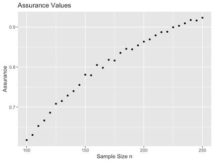
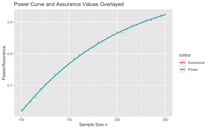
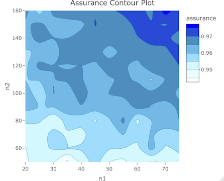
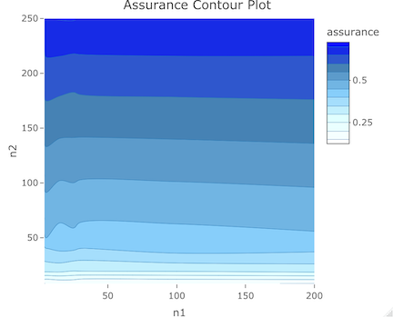

<style type="text/css">

body{ /* Normal  */
      font-size: 13px;
  }
td {  /* Table  */
  font-size: 12px;
}
h1.title {
  font-size: 32px;
}
h1 { /* Header 1 */
  font-size: 28px;
}
h2 { /* Header 2 */
    font-size: 22px;
}
h3 { /* Header 3 */
  font-size: 18px;
  font-family: "Times New Roman", Times, serif;
}
code.r{ /* Code block */
    font-size: 12px;
}
pre { /* Code block - determines code spacing between lines */
    font-size: 14px;
}
</style>

```{r, echo = FALSE, include = TRUE}
knitr::opts_chunk$set(
  collapse = TRUE,
  comment = "#>"
)
options(rmarkdown.html_vignette.check_title = FALSE)
```

```{r, echo = FALSE, include = FALSE, warning = FALSE, results = "hide"}
df_assurvals <- read.csv("Tables/vig2_assurvals.csv", header = TRUE)
df_assurvals_long <- read.csv("Tables/vig2_assurvals_long.csv", header = TRUE)
df_assurvals_unbalanced <- read.csv("Tables/vig2_assurvals_unbalanced.csv", header = TRUE)
df_assurvals_unbal_costeff <- read.csv("Tables/vig2_assurvals_unbal_costeff.csv", header = TRUE)
```

This vignette offers an in-depth walkthrough of the simulation-based
functions that are based in the conjugate linear model setting within 
the `bayesassurance` package. This includes `bayes_sim()`,
`bayes_sim_unbalanced()`, and `bayes_sim_unknownvar()`. We also 
review supplementary functions that help generate design matrices
when users are unable to provide them. 
The following sections elaborate on the underlying 
framework embedded within each of these functions followed 
by example code segments. 


# The `bayes_sim()` Function

The `bayes_sim()` function estimates the assurance by determining
the proportion of MC samples that meet a pre-specified condition
described later in this section.
The underlying algorithm of the function
works in the context of conjugate Bayesian linear regression models, 
in which a set of $n$ observations denoted by 
$y = (y_1, y_2, \cdots, y_n)^{\top}$ are to be collected
in the presence of $p$ controlled explanatory variables,
$x_1, x_2, \cdots, x_p$. Specifically,
\[y = X_n\beta + \epsilon_n,\] 
where $X_n$ is an $n \times p$ design matrix with the $i$-th row 
corresponding to $x_i$, and $\epsilon_n \sim N(0, \sigma^2V_n)$, 
where $V_n$ is a known $n \times n$ correlation matrix. 
A conjugate Bayesian linear regression model specifies the
joint distribution of parameters $\{\beta, \sigma^2\}$
and $y$ as 
\[
IG(\sigma^2|a_{\sigma}, b_{\sigma}) \times N(\beta|\mu_{\beta}^{(a)},
\sigma^2V_{\beta}^{(a)}) \times N(y | X_n\beta, \sigma^2V_n).
\]

**Analysis Stage**

Depending on the objective of our study, we may either be 
interested in defining a one-sided or two-sided objective. 
Suppose we implement a one-sided test to assess whether the linear
contrast of unknown parameter $\beta$ is greater than some constant $C$. 
The `bayes_sim()` function finds the assurance of the realized 
data favoring $H: u^{\top}\beta > C$, where $u$ is a 
$p \times 1$ vector of fixed contrasts.
We start in the analysis stage and frame the condition that
is to be observed. Inference proceeds from the posterior 
distribution given by 
\[
p(\beta, \sigma^2|y) = IG(\sigma^2|a_{\sigma}^*, b_{\sigma}^*)
\times N(\beta|M_nm_n, \sigma^2M_n),
\]
where $a^*_{\sigma} = a_{\sigma}+\frac{n}{2}$, $b^*_{\sigma} = b_{\sigma} +
\frac{1}{2}\left\{\mu_{\beta}^{\top}V_{\beta}^{-1}\mu_{\beta} +
y^{\top}V_n^{-1}y - m_n^{\top}M_nm_n\right\}$, $M_n^{-1} =
V_{\beta}^{-1(a)} + X_n^{\top}V_n^{-1}X_n$ and $m_n =
V_{\beta}^{-1(a)}\mu_{\beta}^{(a)} + X_n^{\top}V_n^{-1}y$.
The posterior distribution helps shape our
analysis objective. The superscripts (a) denote that 
the parameters take place in the analysis stage.

If $\sigma^2$ is known and fixed, then the posterior distribution of 
$\beta$ is $\displaystyle p(\beta | \sigma^2, y) = N(\beta | 
M_nm_n, \sigma^2M_n)$ as shown
in the equation above. Referring back to the evaluation of
$H: u^{\top}\beta > C$, standardization leads to
\begin{equation} \label{eq1}                                                                    
\left.\frac{u^{\top}\beta - u^{\top}M_nm_n}{\sigma \sqrt{u^{\top}M_nu}} \right| \sigma^2, y \sim N(0,1)\;.
\end{equation}

To evaluate the credibility of $H: u^{\top}\beta > C$, we decide 
in favor of $H$ if the observed data belongs in the region
\begin{align*}
    A_{\alpha}(u, \beta, C) &= \left\{y: P\left(u^{\top}\beta
    \leq C | y\right)  < \alpha\right\} = \left\{y: \Phi
    \left(\frac{C - u^{\top}M_n m_n}{\sigma \sqrt{u^{\top}M_nu}}\right)
    < \alpha \right\}.
\end{align*}
This defines our analysis objective. Alternatively, if we wanted to
evaluate the tenability of $H: u^{\top}\beta < C$ this can easily be done 
by adjusting the corresponding sign in the expression. If we wanted
to evaluate the tenability of $H: u^{\top}\beta \neq C$, the observed
region becomes
\[
    A_{\alpha}(u, \beta, C) = \left\{y: P\left(u^{\top}\beta
    \leq C | y\right)  < \alpha/2 \right\} \text{ or } 
    \left\{y: P\left(u^{\top}\beta > C | y\right)  < \alpha/2\right\}.
\]

**The Design Stage**

From here we shift to the design stage,
whose purpose is to seek a sample size $n$ such that the
analysis objective is met 100$\delta \%$ of the time,
where $\delta$ is the assurance.
Doing this requires determining the marginal 
distribution of $y$, which is assigned a separate set 
of priors to quantify our belief about the population 
from which the sample will be taken. Hence, the marginal 
of $y$ under the design priors will be derived from 
\begin{align}\label{eq: ohagan_stevens_linear_regression_design_priors}
  y &=  X_n\beta + e_n; \quad e_n \sim N(0, \sigma^2 V_n)\;;\quad \beta = \mu_{\beta}^{(d)} + \omega; \quad \omega \sim N(0, \sigma^2 V_{\beta}^{(d)})\;,
\end{align}
where $\beta\sim N(\mu_{\beta}^{(d)},\sigma^2 V_{\beta}^{(d)})$ is the design prior on $\beta$. Substituting the equation for $\beta$ into the equation for $y$ 
gives $y = X\mu_{\beta}^{(d)} + (X\omega + e_n)$ and, hence, $y \sim N\left(X\mu_{\beta}^{(d)}, \sigma^2V_n^{*}\right)$, where $V_n^{\ast} = \left(XV_{\beta}^{(d)}X^{\top} + V_n\right)$. 

**Summary**

To summarize our simulation strategy for estimating
the Bayesian assurance, we fix sample size $n$ and generate
a sequence of $J$ datasets $y^{(1)}, y^{(2)}, ..., y^{(J)}$.
Then, a Monte Carlo estimate of the Bayesian assurance is
\[
\hat{\delta}(n) = \frac{1}{J}\sum_{j=1}^J \mathbb{I}\left(\left\{y^{(j)}:
    \Phi \left(\frac{C - u^{\top}M_n^{(j)}m_n^{(j)}}{\sigma
    \sqrt{u^{\top}M_n^{(j)}u}}\right) < \alpha \right\}\right)\;,
\]
where $\mathbb{I}(\cdot)$ is the indicator function of the
event in its argument, $M_n^{(j)}$ and $m_n^{(j)}$ are the
values of $M_n$ and $m_n$ computed from $y^{(j)}$.
<!-- Sampling from the joint posterior distribution of -->
<!-- $\{\beta,\sigma^2\}$ is achieved by first sampling -->
<!-- $\sigma^2 \sim IG(a^*_{\sigma}, b^*_{\sigma})$ and -->
<!-- then sampling $\beta \sim N(M_nm_n, \sigma^2 M_n)$ -->
<!-- for each sampled $\sigma^2$. -->

## Examples

Load in the `bayesassurance` package.
```{r, echo = TRUE, include = TRUE, warning = FALSE, results = "hide"}
library(bayesassurance)
```


Specify the following inputs:

1. `n`: sample size (either scalar or vector). If vector, each unique
value corresponds to a separate study design. 
2. `p`: number of explanatory variables being considered. Also denotes the column dimension of 
design matrix `Xn`. If `Xn = NULL`, `p` must be specified for the function to assign a default
design matrix for `Xn`.
3. `u`: a scalar or vector embedded in the linear contrast that delineates our assessment of
either $u^{\top}\beta > C$, $u^{\top}\beta < C$, or $u^{\top}\beta \neq C$. 
4. `C`: constant that linear contrast is being compared to.
5. `Xn`: an $n \times p$ design matrix that characterizes the observations given by
the normal linear regression model $y = X_n\beta + \epsilon_n$, where 
$\epsilon_n \sim N(0, \sigma^2V_n)$. See above description for details. 
Default `Xn` is an $np \times p$ matrix comprised of $n \times 1$ ones vectors 
that run across the diagonal of the matrix.
6. `Vbeta_d`: correlation matrix that characterizes prior information on 
$\beta$ in the design stage, i.e. $\beta \sim N(\mu_{\beta}^{(d)}, \sigma^2
V_{\beta}^{(d)})$.
7. `Vbeta_a_inv`: inverse-correlation matrix that characterizes 
prior information on $\beta$ in the analysis stage, i.e. $\beta \sim
N(\mu_{\beta}^{(a)}, \sigma^2V_{\beta}^{(a)})$. The inverse is
passed in for convenience sake, i.e. $V_{\beta}^{-1(a)}$
8. `Vn`: an $n \times n$ correlation matrix for the marginal distribution of 
the sample data $y$. Takes on an identity matrix when set to NULL.
9. `sigsq`: a known and fixed constant preceding all correlation matrices `Vn`, `Vbeta_d`
and `Vbeta_a_inv`
10. `mu_beta_d`: design stage mean, $\mu_{\beta}^{(d)}$
11. `mu_beta_a`: analysis stage mean, $\mu_{\beta}^{(a)}$
12. `alt`: specifies alternative test case, where `alt = "greater"` tests if \eqn{u'\beta > C},
`alt = "less"` tests if \eqn{u'\beta < C}, and `alt = "two.sided"` performs a two-sided test. By default, `alt = "greater"`.
12. `alpha`: significance level
13. `mc_iter`: number of MC samples evaluated under the analysis objective

**Example 1: One-Dimensional Setting**

We start with a simple example that considers a scalar parameter $\beta$ in evaluating
the credibility of $H: u^{\top}\beta > C$. We assign the following set of inputs for the
`bayes_sim()` function and save the output as `assur_vals`.
Some key points to note:

1. Since a vector is being passed into sample size $n$, we should
also expect a vector of assurance values to be returned.
2. Setting `p = 1`, `u = 1` and `C = 0.15` implies we are 
evaluating the tenability of $H: \beta > 0.15$, where $\beta$ is a scalar.
3. `Vbeta_d` and `Vbeta_a_inv` are scalars to conform with the dimension of
$\beta$. A weak analysis prior (`Vbeta_a_inv = 0`) and a strong design prior
(`Vbeta_d = 1e-8`) are assigned for the purpose of demonstrating
the overlapping scenario that takes place between the Bayesian and 
frequentist settings.
4. `Xn` and `Vn` are set to `NULL` which means they will take on
the default settings specified in the parameter descriptions above. 
\textit{If a vector of `n` is being passed in and customized correlation matrices
are needed for each unique `n`, please note that a vector of `Xn` 
and `Vn` corresponding to each separate `n` needs to be passed in.}
```{r, echo = TRUE, include = TRUE, eval = FALSE}
n <- seq(100, 250, 5)

set.seed(10)
assur_vals <- bayes_sim(n, p = 1, u = 1, C = 0.15, Xn = NULL,
                                        Vbeta_d = 1e-8, Vbeta_a_inv = 0,
                                        Vn = NULL, sigsq = 0.265, 
                                        mu_beta_d = 0.25, mu_beta_a = 0, 
                                        alt = "greater", alpha = 0.05, mc_iter = 10000)
```

Within `assur_vals` contains a list of two outputs: 

1. `assurance_table`: table of sample sizes and corresponding assurance values.
2. `assur_plot`: plot of estimated assurance values with sample size $n$ running along
the x-axis.

The first six entries of the resulting power table can be seen by calling 
`pwr_vals$pwr_table`.
```{r, echo = TRUE, include = TRUE, warning = FALSE, results=FALSE, eval = FALSE}
head(assur_vals$assurance_table)
```

```{r, echo = FALSE, include = TRUE, warning = FALSE}
library(knitr)
tab <- df_assurvals
kable(head(tab))
```

The assurance plot is produced using the `ggplot2` package. It displays the
inputted sample sizes on the x-axis and the resulting assurance values on the y-axis.
```{r, echo = TRUE, include = TRUE, warning = FALSE, eval = FALSE}
assur_vals$assurance_plot
```

```{r, echo = FALSE, out.width = "50%"}
library(knitr)

```

Notice that if we input the following parameters into the `pwr_freq()` function,
we observe an approximate overlap between the assurance and power values.

```{r, echo = TRUE, include = TRUE, results = 'hide', eval = FALSE}
n <- seq(100, 250, 5)
y1 <- bayesassurance::pwr_freq(n = n, sigsq = 0.265, alt = "greater", alpha = 0.05, 
                               theta_0 = 0.15, theta_1 = 0.25)
y2 <- assur_vals

library(ggplot2)
p1 <- ggplot2::ggplot(y1$pwr_table, alpha = 0.5, 
                      aes(x = n, y = Power, color="Power")) +
  geom_line(lwd=1.2) + geom_point(data = y2$assurance_table, alpha = 0.5,
  aes(y = y2$assurance_table$Assurance, color="Assurance"),lwd=1.2) + 
  ggtitle("Power Curve and Assurance Values Overlayed") + xlab("Sample Size n") +
  ylab("Power/Assurance")

p1
```


```{r, echo = FALSE, out.width = "50%"}
library(knitr)

```


**Example 2: Use of Linear Contrasts**

In this next example, we assume $\beta$ is a vector of
unknown components. We refer to
the cost-effectiveness application discussed in O'Hagan et al. 2001
to demonstrate a real-world setting. The application 
considers a randomized clinical trial 
that compares the cost-effectiveness of two treatments,
where the cost-effectiveness is evaluated using
a net monetary benefit measure expressed as
\[
\xi = K(\mu_2 - \mu_1) - (\gamma_2 - \gamma_1),
\]
where $\mu_2 - \mu_1$ and $\gamma_2 - \gamma_1$
corresponds to the true differences in 
treatment efficacy and costs, respectively,
between Treatments 1 and 2. The threshold unit cost, 
$K$, represents the maximum price that a 
health care provider is willing to pay for a 
unit increase in efficacy. Note that the indices
of $\mu$ and $\gamma$ indicate whether we are 
looking at Treatment 1 or 2. 

In this setting, we seek the tenability of $H: \xi > 0$, which 
if true, indicates that Treatment 2 is more
cost-effective than Treatment 1.
Since the net monetary benefit formula 
involves assessing the cost and efficacy components 
conveyed within each of the two treatment groups, we set 
$\beta = (\mu_1, \gamma_1, \mu_2, \gamma_2)^{\top}$,
where $\mu_i$ and $\gamma_i$ denote the efficacy and
cost for treatments $i = 1, 2$. We therefore set
$u = (-K, 1, K, -1)^{\top}$ and $C = 0$, which lets us 
evaluate an equivalent form of $\xi > 0$ re-expressed 
$u^{\top}\beta > 0$. All other inputs of this application
were either specified or deduced from the paper.

The following set of inputs specified
in the subsequent code chunk should result in 
an assurance of approximately 0.70 according to
O'Hagan et al. 2001. The `bayes_sim()`
returns a similar value, demonstrating
that sampling from the posterior yields results similar
to those reported in the paper. 

```{r, echo = TRUE, include = TRUE, eval = FALSE, results = "hide"}
n = 285
p = 4
K = 20000 # threshold unit cost
C <- 0
u <- as.matrix(c(-K, 1, K, -1))
sigsq <- 4.04^2

## Assign correlation matrices to analysis and design stage priors
Vbeta_a_inv <- matrix(rep(0, p^2), nrow = p, ncol = p)

Vbeta_d <- (1 / sigsq) * matrix(c(4, 0, 3, 0, 0, 10^7, 0, 0, 3, 0, 4, 0, 0, 0, 0, 10^7),
nrow = 4, ncol = 4)

tau1 <- tau2 <- 8700
sig <- sqrt(sigsq)
Vn <- matrix(0, nrow = n*p, ncol = n*p)
Vn[1:n, 1:n] <- diag(n)
Vn[(2*n - (n-1)):(2*n), (2*n - (n-1)):(2*n)] <- (tau1 / sig)^2 * diag(n)
Vn[(3*n - (n-1)):(3*n), (3*n - (n-1)):(3*n)] <- diag(n)
Vn[(4*n - (n-1)):(4*n), (4*n - (n-1)):(4*n)] <- (tau2 / sig)^2 * diag(n)

## Assign mean parameters to analysis and design stage priors
mu_beta_d <- as.matrix(c(5, 6000, 6.5, 7200))
mu_beta_a <- as.matrix(rep(0, p))

set.seed(10)
assur_vals <- bayesassurance::bayes_sim(n = 285, p = 4, u = as.matrix(c(-K, 1, K, -1)), 
                                        C = 0, Xn = NULL,
                                        Vbeta_d = Vbeta_d, Vbeta_a_inv = Vbeta_a_inv,
                                        Vn = Vn, sigsq = 4.04^2, 
                                        mu_beta_d = as.matrix(c(5, 6000, 6.5, 7200)), 
                                        mu_beta_a = as.matrix(rep(0, p)), 
                                        alt = "greater", alpha = 0.05, mc_iter = 10000)

assur_vals$assur_val
```

```{r, echo = FALSE, include = TRUE}
print("Assurance: 0.724")
```

## `bayes_sim()` Special Case: Longitudinal Design

We demonstrate an additional setting
embedded in the `bayes_sim()` function tailored to longitudinal data. 
Referring back to the linear regression model discussed
in the general framework, we can construct a longitudinal model that utilizes
the same linear regression form, where
\[
y = X_n\beta + \epsilon_n.
\]
 
Consider a group of subjects with an equal
number of repeated measures at equally-spaced time points,
i.e. a balanced longitudinal study. 
These subjects can be characterized by 
\[
y_{ij} = \beta_{0i} + \beta_{1i}t_{ij} + \epsilon_{ij}, 
\]
where $y_{ij}$ denotes the $j^{th}$ observation of subject
$i$ at time $t_{ij}$, $\beta_{0i}$ and $\beta_{1i}$ respectively
denote the intercept and slope terms for subject $i$, 
and $\epsilon_{ij}$ is an error term characterized by 
$\epsilon \sim N(0, \sigma^2_i)$. 

In a simple case where we only have two subjects, each
with $n$ repeated measures, we can individually 
express the observations as
\begin{align*}
y_{11} &= \beta_{01} + \beta_{11}t_{11} + \epsilon_{11}\\
&\vdots\\
y_{1n} &= \beta_{01} + \beta_{11}t_{1n} + \epsilon_{1n}\\
y_{21} &= \beta_{02} + \beta_{12}t_{21} + \epsilon_{21}\\
&\vdots\\
y_{2n} &= \beta_{02} + \beta_{12}t_{2n} + \epsilon_{2n}.
\end{align*}
The model can also be expressed cohesively using matrices,
\begin{gather}
 \underbrace{\begin{pmatrix} y_{11} \\ \vdots \\ y_{1n} \\ y_{21} \\ \vdots\\ y_{2n} \end{pmatrix}}_{y}
 =

   \underbrace{
   \begin{pmatrix}
   1 & 0 & t_{11} & 0\\
   \vdots & \vdots & \vdots & \vdots \\
   1 & 0 & t_{1n} & 0\\
   0 & 1 & 0 & t_{21}\\
   \vdots & \vdots & \vdots & \vdots \\
   0 & 1 & 0 & t_{2n}
   \end{pmatrix}
   }_{X_n}


   \underbrace{
      \begin{pmatrix}
         \beta_{01}\\
         \beta_{02}\\
         \beta_{11}\\
         \beta_{12}
      \end{pmatrix}
   }_{\beta}

   
   + 
   
   \underbrace{
   \begin{pmatrix}
   \epsilon_{11}\\
   \vdots\\
   \epsilon_{1n}\\
   \epsilon_{21}\\
   \vdots\\
   \epsilon_{2n}
   \end{pmatrix}
   }_{\epsilon_n}

\end{gather}
bringing us back to the linear regression model form. 

**Example 3: Longitudinal Setting**

The following example uses similar parameter settings as 
the previous cost-effectiveness example along with 
longitudinal specifications. We assume two subjects and
want to test whether the growth rate of subject 1
is greater than that of subject 2. This could have either positive
or negative implications depending on the measurement scale. 

Assigning an appropriate linear contrast
lets us evaluate this under the general expression, 
$u^{\top}\beta > C$, where
$u = (1, -1, 1, -1)^{\top}$ and $C = 0$. The timepoints
are arbitrarily chosen to be 10 through 120- this
could be days, months, or years depending on the context
of the problem. The number of repeated measurements per subject
to be tested includes values 10 through 100 in increments of 5. 
This indicates that we are evaluating
the assurance for 19 study designs in total. $n = 10$ 
divides the specified time interval 
into 10 evenly-spaced timepoints between 10 and 120.

For a more complicated study design consisting of more
than two subjects that are divided into two treatment groups, 
the user could consider testing if the mean 
growth rate is higher in the first treatment group versus the second, 
e.g. if we have three subjects per treatment group, 
the linear contrast could be set as 
$u = (0, 0, 0, 0, 0, 0, 1/3, 1/3, 1/3, -1/3, -1/3, -1/3)^{\top}$. 

```{r, echo = TRUE, include = TRUE, message = FALSE, eval = FALSE}
n <- seq(10, 100, 5)
ids <- c(1,2)
sigsq <- 100
Vbeta_a_inv <- matrix(rep(0, 16), nrow = 4, ncol = 4)
Vbeta_d <- (1 / sigsq) * matrix(c(4, 0, 3, 0, 0, 6, 0, 0, 3, 0, 4, 0, 0, 0, 0, 6), 
                                nrow = 4, ncol = 4)

assur_out <- bayes_sim(n = n, p = NULL, u = c(1, -1, 1, -1), C = 0, Xn = NULL,
                       Vbeta_d = Vbeta_d, Vbeta_a_inv = Vbeta_a_inv,
                       Vn = NULL, sigsq = 100,
                       mu_beta_d = as.matrix(c(5, 6.5, 62, 84)),
                       mu_beta_a = as.matrix(rep(0, 4)), mc_iter = 5000,
                       alt = "two.sided", alpha = 0.05, longitudinal = TRUE, ids = ids,
                       from = 10, to = 120)

```

```{r, echo = TRUE, include = TRUE, eval = FALSE, results = "hide"}
head(assur_out$assurance_table)
```

```{r, echo = FALSE, include = TRUE}
library(knitr)
kable(head(df_assurvals_long))
```


```{r, echo = TRUE, include = TRUE, eval = FALSE, results = "hide"}
assur_out$assurance_plot
```

```{r, echo = FALSE, out.width = "50%"}
library(knitr)
knitr::include_graphics("Images/bayes_sim_long.png")
```


# The `bayes_sim_unbalanced()` Function 

The `bayes_sim_unbalanced()` function relies on the same analysis and
design stage framework as `bayes_sim()` but lets users pass in unequal
pairs of sample sizes to determine the assurance of achieving
the analysis objective for a multi-sample study design characterized by two
distinct sample sizes (e.g. two-sample design with different sized
groups, four-sample design with two groups having the same sample size
while the other two groups have a different sample size). This
is unlike the `bayes_sim()` function that determines the assurance 
solely for balanced study designs. 
<!-- Users could pass in either a scalar -->
<!-- or vector of values, where each value denotes a  -->
<!-- separate study containing $p$ explanatory variables -->
<!-- of equal sample size.  -->

The `bayes_sim_unbalanced()` function is very similar to
`bayes_sim()` in terms of parameter specifications. 
There are a few noteworthy exceptions that are listed
below.

1. `n1`: first sample size (vector or scalar). Note that a vector
can only be passed in when `Xn = NULL`. If users choose to specify 
their own design matrix, `n1` must be a scalar as the specified `Xn` 
would correspond to a single study design for a specific sample size. 
2. `n2`: second sample size (vector or scalar). Note that a vector
can only be passed in when `Xn = NULL`. If users choose to specify 
their own design matrix, `n2` must be a scalar as the specified `Xn` 
would correspond to a single study design for a specific sample size. 
3. `repeats`: an integer giving the number of times to repeat `c(n1, n2)`. 
Applicable for study designs that have more than two explanatory variables containing
the same sample sizes specified in `n1` and `n2`. Set to `repeats = 1` by default.
3. `surface_plot`: logical parameter that specifies whether user wishes
to view a contour plot. when set to `TRUE`, and `n1` and `n2` are vectors,
a contour plot (i.e. heat map) showcasing assurances obtained for unique 
combinations of `n1` and `n2` is produced. 

The resulting outputs are as follows:

1. `assurance_table`: table of sample size and corresponding
assurance values
2. `contourplot`: contour map of assurance values if `surface_plot = TRUE`
3. `mc_samples`: number of Monte Carlo samples that were generated
for evaluation


## Examples 

**Example 1: Simple Example**

Similar to `bayes_sim()`, we let `Xn = NULL`
to allow our function to automatically generate a design matrix
using `bayesassurance::gen_Xn()`, which is discussed in a 
later section. 
Note that `n1` and `n2` can each take a vector of equal length,
where a vector of assurance values will be returned corresponding
to the distinct pairs of `n1` and `n2`. 

```{r, echo = TRUE, include = TRUE, message = FALSE, eval = FALSE}
n1 <- seq(20, 75, 5)
n2 <- seq(50, 160, 10)

set.seed(100)
assur_out <- bayes_sim_unbalanced(n1 = n1, n2 = n2, repeats = 1, u = c(1, -1),
             C = 0, Xn = NULL, Vbeta_d = matrix(c(50, 0, 0, 10),nrow = 2, ncol = 2),
             Vbeta_a_inv = matrix(rep(0, 4), nrow = 2, ncol = 2),
             Vn = NULL, sigsq = 100,  mu_beta_d = c(1.17, 1.25),
             mu_beta_a = c(0, 0), alt = "two.sided", alpha = 0.05, mc_iter = 5000,
             surface_plot = TRUE)
```

```{r, echo = TRUE, include = TRUE, message = FALSE, results = "hide", eval = FALSE}
## Outputs
head(assur_out$assurance_table)
```

```{r, echo = FALSE, include = TRUE}
## Outputs
library(knitr)
kable(head(df_assurvals_unbalanced))
```


```{r, echo = TRUE, include = TRUE, message = FALSE, eval = FALSE, results = "hide"}
assur_out$contourplot
```

```{r, echo = FALSE, out.width = "50%"}
library(knitr)

```

**Example 2: Cost-effectiveness Example**

We revisit the cost-effectiveness example demonstrated in the `bayes_sim()`
discussion. In this example, we need to make use of the `repeats`
parameter as the two sample sizes we are defining correspond to 
four explanatory variables, i.e. two sets of efficacy and cost 
measurements pertaining to Treatments 1 and 2. 

```{r, echo = TRUE, include = TRUE, message = FALSE, eval = FALSE}
n1 <- c(4, 5, 15, 25, 30, 100, 200)
n2 <- c(8, 10, 20, 40, 50, 200, 250)

mu_beta_d <- as.matrix(c(5, 6000, 6.5, 7200))
mu_beta_a <- as.matrix(rep(0, 4))
K = 20000 # threshold unit cost
C <- 0
u <- as.matrix(c(-K, 1, K, -1))
sigsq <- 4.04^2
Vbeta_a_inv <- matrix(rep(0, 16), nrow = 4, ncol = 4)
Vbeta_d <- (1 / sigsq) * matrix(c(4, 0, 3, 0, 0, 10^7, 0, 0, 3, 0, 4, 0, 0, 0, 0, 10^7),
                                nrow = 4, ncol = 4)

set.seed(12)
assur_out <- bayes_sim_unbalanced(n1 = n1, n2 = n2, repeats = 2, u = as.matrix(c(-K, 1, K, -1)), 
                                  C = 0, Xn = NULL, Vbeta_d = Vbeta_d,
                                  Vbeta_a_inv = Vbeta_a_inv,
                                  Vn = NULL, sigsq = 4.04^2, 
                                  mu_beta_d = as.matrix(c(5, 6000, 6.5, 7200)), 
                                  mu_beta_a = as.matrix(rep(0, 4)), alt = "greater", 
                                  alpha = 0.05, mc_iter = 5000, surface_plot = TRUE)


```

View the outputs. 

```{r, echo = TRUE, include = TRUE, eval = FALSE, results = "hide"}
head(assur_out$assurance_table)
```

```{r, echo = FALSE, include = TRUE}
## Outputs
library(knitr)
kable(head(df_assurvals_unbal_costeff))
```


```{r, echo = TRUE, include = TRUE, eval = FALSE, results = "hide"}
assur_out$contourplot
```

```{r, echo = FALSE, out.width = "50%"}
library(knitr)

```


# The `bayes_sim_unknownvar()` Function
Similar to the `bayes_sim()` function, the `bayes_sim_unknownvar()` function takes 
in a set of inputs and returns the approximate Bayesian assurance by 
determining the proportion of MC samples that meet the analysis stage objective.
The `bayes_sim_unknownvar()` function is used when the variance $\sigma^2$ is unknown.
Hence, the simulation itself relies on an additional step that involves
generating a $\sigma^2$ prior to evaluating the analysis objective. 

**Analysis Stage**

Our region of interest corresponding to our analysis objective still 
remains as $A_{\alpha}(u, \beta, C) = \left\{y: P\left(u^{\top}\beta 
\leq C | y\right)  < \alpha\right\}$ when deciding whether or not 
we are in favor of $H$. To implement this in a simulation setting, we rely on 
iterative sampling for both $\beta$ and $\sigma^2$ to estimate the assurance. 
We specify analysis priors $\beta | \sigma^2 \sim N(\mu_{\beta}^{(a)},
\sigma^2V_{\beta}^{(a)})$ and $\sigma^{2} \sim IG(a^{(a)}, b^{(a)})$, 
where the superscripts $(a)$ signify analysis priors.

We had previously derived the posterior distribution of $\beta$
expressed as $p(\beta | y, \sigma^{2}) = N(\beta | M_nm_n, 
\sigma^{2}M_n)$, where $M_n = (V_\beta^{-1(a)} + X^{\top} V_n^{-1} X)^{-1}$
and $m_n = V_\beta^{-1(a)}\mu_\beta^{(a)} + X^{\top}V_n^{-1}y$.
The posterior distribution of $\sigma^{2}$ is obtained by integrating out $\beta$ from the joint posterior distribution of $\{\beta, \sigma^2\}$, which yields
\begin{equation}\label{eq: postbeta}
   \begin{split}
   p(\sigma^2| y) &\propto IG(\sigma^2| a^{(a)},b^{(a)}) \times \int
   N(\beta | \mu_{\beta}, \sigma^2 V_{\beta}) \times N(y | X\beta,
   \sigma^2 V_{n}) d\beta\\ &\propto \left(\frac{1}{\sigma^2}\right)^{a^{(a)}+
   \frac{n}{2} + 1}\exp\left\{-\frac{1}{\sigma^2}\left(b^{(a)} +
   \frac{c^{\ast}}{2}\right)\right\}\;.
   \end{split}
\end{equation}
Therefore, $p(\sigma^2| y) =
IG\left(\sigma^2| a^{\ast}, b^{\ast}\right)$, where $a^{\ast} = a^{(a)} + \frac{n}{2}$ and $b^{\ast} = b^{(a)} + \frac{c^{\ast}}{2} = b^{(a)} + \frac{1}{2}
\left\{\mu_{\beta}^{\top (a)} V_{\beta}^{-1(a)}\mu_{\beta}^{(a)} +
y^{\top}V_n^{-1}y -  m_n^{\top}M_nm_n\right\}$.

**Design Stage**

Recall the design stage objective aims to identify sample size $n$ that
is needed to attain the assurance level specified by the investigator. Similar to
Section~\ref{subsec: ohagan_stevens_linear_regression_known_sigma} we
will need the marginal distribution of $y$ with priors placed on both $\beta$ and $\sigma^2$. We denote these design priors as $\beta^{(d)}$ and $\sigma^{2(d)}$, respectively, to signify that we are working within the design stage. Derivation steps are almost identical to those outlined in `bayes_sim()` for the known $\sigma^2$ case. With $\sigma^{2(d)}$ now treated as an unknown parameter, the marginal distribution of $y$, given $\sigma^{2(d)}$, under the design prior is derived from $y =  X_n\beta^{(d)} + e_n$, $ e_n \sim N(0, \sigma^{2(d)} V_n)$, $\beta^{(d)} = \mu_{\beta}^{(d)} + \omega; \quad \omega \sim  N(0, \sigma^{2(d)} V_{\beta}^{(d)})$, where $\beta^{(d)}\sim N(\mu_{\beta}^{(d)},\sigma^{2(d)} V_{\beta}^{(d)})$
and $\sigma^{2(d)} \sim IG(a^{(d)}, b^{(d)})$. Substituting $\beta^{(d)}$ into
$y$ gives us $y = X_n\mu_{\beta}^{(d)} + (X_n\omega + e_n)$ such that $X_n\omega + e_n \sim N(0, \sigma^{2(d)}(V_n + X_n V_{\beta}^{(d)} X_n^{\top}))$.
The marginal distribution of $p(y| \sigma^{2(d)})$ is
\begin{equation}\label{eq:marg_yn}
   y | \sigma^{2(d)} \sim N(X_n \mu_{\beta}^{(d)}, \sigma^{2(d)} V_n^{*}); \quad
   V_n^{*} = X_n V_{\beta}^{(d)} X_n^{\top} + V_n.
\end{equation}
Equation~\eqref{eq:marg_yn} specifies our data generation model for ascertaining sample size.

**Summary**

In the design stage, we draw $\sigma^{2(d)}$ from
$IG(a_\sigma^{(d)}, b_\sigma^{(d)})$ and generate the data from our sampling distribution from \eqref{eq:marg_yn}, $y \sim N(X\mu_{\beta}^{(d)}, \sigma^{2(d)}(XV_{\beta}^{(d)}X^{\top} + V_n))$. For each such data set, $\{y, X_n\}$, we perform Bayesian inference for $\beta$ and $\sigma^2$. Here, we draw $J$ samples of $\beta$ and $\sigma^2$ from their respective posterior distributions and compute the proportion of  these $J$ samples that satisfy $u^{\top} \beta_j > C$. If the proportion exceeds a certain threshold $1-\alpha$, then the analysis objective is met for that dataset. The above steps for the design and analysis stage are repeated
for $R$ datasets and the proportion of the $R$ datasets that meet the analysis objective, i.e., deciding in favor of $H$, correspond to the Bayesian assurance.

## Example

Taking the exact same inputs as those in the first example of `bayes_sim()`, we
modify the inputs and perform the simulation using `bayes_sim_unknownvar()` instead.


```{r, echo = TRUE, include = TRUE, eval = FALSE}
n <- seq(100, 250, 5)
assur_vals <- bayesassurance::bayes_sim(n, p = 1, u = 1, C = 0.15, Xn = NULL,
                                       Vbeta_d = 1e-8, Vbeta_a_inv = 0,
                                        Vn = NULL, sigsq = 0.265,
                                        mu_beta_d = 0.25, mu_beta_a = 0,
                                      alpha = 0.05, mc_iter = 10000)


assur_vals <- bayesassurance::bayes_sim_unknownvar(n, p = 1, u = 1,
                                         C = 0.15, R = 150, Xn = NULL, Vn = NULL,
                                         Vbeta_d = 1e-8, Vbeta_a_inv = 0,
                                         mu_beta_d = 0.25, mu_beta_a = 0,
                                         a_sig_a = 0.1, b_sig_a = 0.1,
                                         a_sig_d = 0.1, b_sig_d = 0.1,
                                         alpha = 0.05, mc_iter = 5000)

```


# Generating the Design Matrix Using `gen_Xn()`

All simulation-based functions contained in the package 
do not require users to specify their own
design matrix $X_n$. Users have the option of setting 
`Xn = NULL`, which prompts the function to construct a default design matrix 
using `bayesassurance::gen_Xn()`. The resulting design matrix depends
on the sample size parameter `n` being passed into `bayes_sim()`.
Each unique sample size contained in `n` results in a distinct design 
matrix. The column dimension of $X_n$ corresponds to the number of 
groups being assessed, denoted by parameter `p`. Each
column is comprised of ones vectors that run diagonally across
the matrix with lengths that correspond
to the sample size value. 

The following examples showcase the general functionality of
`gen_Xn()` as well as how `gen_Xn()` is specifically used 
within `bayes_sim()`. 

**Example 1**

As a general example, suppose we pass in a vector
of length 4 into `gen_Xn()`. The function will interpret
this as a study design consisting of 4 explanatory variables with 
unequal observed frequencies of 1, 2, 3, and 4. This will result in 
$X_n$ having 4 columns containing ones vectors of lengths
1, 2, 3, and 4 respectively. 

```{r, echo = TRUE, include = TRUE}
n <- c(1,2,3,4)
bayesassurance::gen_Xn(n)
```

**Example 2**

The `bayes_sim()` function assumes a balanced study design
such that the $p$ explanatory variables have an equal number of observations. 
When a vector of sample sizes is passed into 
`bayes_sim()` for parameter $n$, each value within $n$ 
corresponds to a separate study design that results in 
a different design matrix. By specifying
$p$, the resulting $X_n$ will have $p$ columns
with ones vectors of equal length running 
diagonally across the matrix. 

```{r, echo = TRUE, include = TRUE}
n <- 3
p <- 4
bayesassurance::gen_Xn(rep(n, p))
```
It is actually encouraged for users to set `Xn = NULL` 
as this will greatly facilitate the process of determining
the assurances for multiple sample sizes at once. 
This saves the trouble of having users define their
own separate design matrices for each sample size. 


# Generating the Design Matrix in a Time-Based Setting Using `gen_Xn_longitudinal()`

When working in the longitudinal setting,
additional parameters need to be specified
prior to running `bayes_sim()`.
These include

1. `longitudinal`: when set to `TRUE`, this informs `bayes_sim()` that
the simulation will be based in a longitudinal setting. If `Xn = NULL`,
the function will construct a design matrix using inputs that correspond
to a balanced longitudinal study design.
2. `ids`: vector of unique subject ids
3. `from`: start time of repeated measures for each subject
4. `to`: end time of repeated measures for each subject

The parameter `n` plays a vital role in this setting as its
value(s) correspond to the number of repeated measures each
subject has. Referring to the sequence generating function, 
`seq()`, in R's base package, the time points for each subject 
are determined as `seq(from = from, to = to, length.out = n)`. 

The longitudinal setting in `bayes_sim()` implicitly relies on the
`bayesassurance::gen_Xn_longitudinal()` function to construct its design matrices.
The user does not need to explicitly call on this function when setting `Xn = NULL`. 
Each unique sample size contained in `n` corresponds to a distinct study design. 

The next example shows how `gen_Xn_longitudinal()` is used.
$X_n$ takes the form of the design matrix highlighted in the linear
regression model discussed in the previous section, comprised of ones vectors in the
first set of columns and vectors of time points in the second half. 
When `Xn = NULL` and `longitudinal = TRUE`, the `bayes_sim()` function will
automatically generate a design matrix using this feature. 

** Example **
```{r, echo = TRUE, include = TRUE}
ids <- c(1,2,3,4)
gen_Xn_longitudinal(ids, from = 1, to = 10, num_repeated_measures = 4)
```


