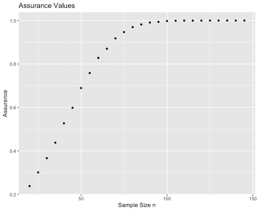
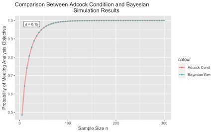
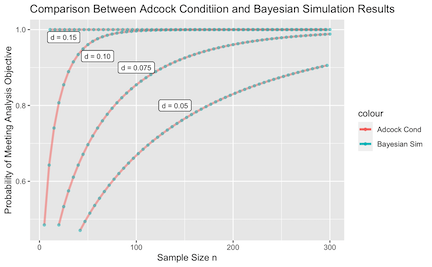
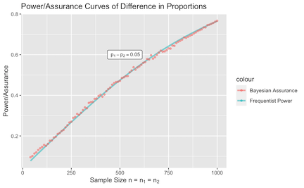
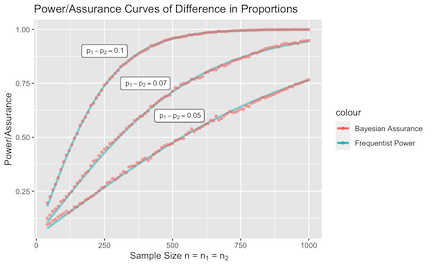
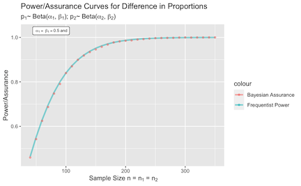
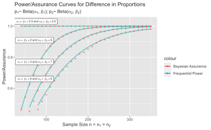

<style type="text/css">

body{ /* Normal  */
      font-size: 13px;
  }
td {  /* Table  */
  font-size: 12px;
}
h1.title {
  font-size: 32px;
}
h1 { /* Header 1 */
  font-size: 28px;
}
h2 { /* Header 2 */
    font-size: 22px;
}
h3 { /* Header 3 */
  font-size: 18px;
  font-family: "Times New Roman", Times, serif;
}
code.r{ /* Code block */
    font-size: 12px;
}
pre { /* Code block - determines code spacing between lines */
    font-size: 14px;
}
</style>

```{r, echo = FALSE, include = TRUE, results = "hide"}
adcock_table <- read.csv("Tables/vig3_assurvals_adcock.csv", header = TRUE, stringsAsFactors = FALSE)
betabin_table <- read.csv("Tables/vig3_assurvals_betabin.csv", header = TRUE, stringsAsFactors = FALSE)
```

# Sample Size Determination Under Precision-Based Conditions

The `bayes_adcock()` function determines the assurance under 
precision-based conditions discussed in Adcock (1997). 
Recall in the frequentist setting, if $X_i \sim N(\theta, \sigma^2)$ 
for $i = 1,..., n$ observations and variance $\sigma^2$ is known, 
the precision can be calculated using $d = z_{1-\alpha/2}\frac{\sigma}{\sqrt{n}}$, 
where $z_{1-\alpha/2}$ is the critical value for the $100(1-\alpha/2)\%$ 
quartile of the standard normal distribution. Simple rearranging leads 
to the following expression for sample size:
\begin{equation}
  n = z_{1-\alpha/2}^2\frac{\sigma^2}{d^2}\;.
\end{equation}

**Analysis Stage**

Given a random sample with mean $\bar{x}$, suppose the goal is to estimate 
population mean $\theta$.

To formulate this problem in the Bayesian setting, suppose $x_1, \cdots, x_n$ 
is a random sample from $N(\theta, \sigma^2)$
and the sample mean is distributed as $\bar{x}|\theta, \sigma^2 \sim 
N(\theta, \sigma^2/n)$.
The analysis objective is to observe that the absolute 
difference between $\bar{x}$ and $\theta$ falls within a margin of 
error no greater than $d$. Given data $\bar{x}$ and a pre-specified 
confidence level $\alpha$, the assurance can be formally expressed as
\begin{equation}
\delta = P_{\bar{x}}\{\bar{x}: P(|\bar{x} - \theta| \leq d) \geq 1-\alpha\}\;.
\end{equation}
We assign $\theta \sim N(\theta_0^{(a)}, \sigma^2/n_a)$ as the 
analysis prior, where $n_a$ quantifies the amount of prior 
information we have for $\theta$.
The posterior of $\theta$ is obtained by taking the product of the prior 
and likelihood, resulting in
\begin{equation}
  N\Bigg(\bar{x} {\left| \theta, \frac{\sigma^2}{n}\right.}\Bigg) \times
  N\Bigg(\theta {\left | \theta_0^{(a)}, \frac{\sigma^2}{n_a}\right.}\Bigg)
  = N\Bigg(\theta {\left | \lambda, \frac{\sigma^2}{n_a+n}\right.}\Bigg),
 \end{equation}
where $\lambda = \frac{n\bar{x}+n_a\theta_0^{(a)}}{n_a+n}$.
From here we can further evaluate the condition using parameters from the posterior of $\theta$ to obtain a more explicit version of the analysis stage objective. From
$P(|\bar{x} - \theta| \leq d) = P(\bar{x} - d \leq \theta \leq \bar{x} + d)$, we can
standardize all components of the inequality using the posterior distribution of $\theta$,
eventually leading to 
\begin{equation}
  \label{eq:adcock_region_simplified}
  \delta = \left\{ \bar{x}: \Phi\left[\frac{\sqrt{n_a + n}}{\sigma}
  (\bar{x} + d - \lambda)\right] - \Phi\left[\frac{\sqrt{n_a+n}}{\sigma}(\bar{x}
  - d - \lambda)\right] \geq 1-\alpha \right\}.
\end{equation}

**Design Stage**

In the design stage, we need to construct a protocol for sampling data 
that will be used to evaluate the analysis objective. This is achieved
by first setting a separate design stage prior on $\theta$ such that $\theta \sim
N(\theta_0^{(d)}, \sigma^2/n_d)$, where $n_d$ quantifies
our degree of belief towards the population from which the sample 
will be drawn. Given that $\bar{x}|\theta, \sigma^2 \sim N(\theta, \sigma^2/n)$, 
the marginal distribution of $\bar{x}$ can be computed using straightforward 
substitution based on $\bar{x} = \theta + \epsilon;$ $\epsilon \sim N(0, \sigma^2/n)$ 
and $\theta = \theta_0^{(d)} + \omega;$ $\omega \sim N(0, \sigma^2/n_d)$.  
Substitution $\theta$ into the expression for $\bar{x}$ gives us
$\bar{x}=\theta_0^{(d)} + (\omega + \epsilon);$
$(\omega + \epsilon) \sim N\Big(0, \frac{\sigma^2(n_d+n)}{n_dn}\Big)
= N(0, \sigma^2/p)$, where $1/p = 1/n_d + 1/n$. The marginal
of $\bar{x}$ is therefore $N(\bar{x}|\theta_0^{(d)}, \sigma^2/p)$, where we will be
iteratively drawing samples from to check if they satisfy the condition
outlined in the analysis stage. 

## Example
First, load in the bayesassurance package.
```{r, echo = TRUE, include = TRUE, warning = FALSE, results = "hide"}
library(bayesassurance)
```

Specify the following inputs:

1. `n`: sample size (either vector or scalar).
2. `d`: precision level in in analysis objective $|\bar{x} - \theta| \leq d$
3. `mu_beta_a`: analysis stage mean
4. `mu_beta_d`: design stage mean
5. `n_a`: sample size at analysis stage. Quantifies the 
amount of prior information we have for parameter $\theta$.
6. `n_d`: sample size at design stage. Quantifies the amount of prior 
information we have for where the data is being generated from.
7. `sig_sq`: known variance $\sigma^2$.
8. `alpha`: significance level
9. `mc_iter`: number of MC samples evaluated under the analysis objective. 

As an example, we assign the following set of arbitrary inputs to pass into
`bayes_adcock()` and save the output as `out`.
Notice that we assign a vector of values to sample size `n` and choose 
arbitrary values for the remaining parameters. 

```{r, echo = TRUE, include = TRUE, eval = FALSE, results = "hide"}
library(ggplot2)
n <- seq(20, 145, 5)

set.seed(20)
out <- bayesassurance::bayes_adcock(n = n, d = 0.20, mu_beta_a = 0.64, mu_beta_d = 0.9, 
                                    n_a = 20, n_d = 10, sig_sq = 0.265, alpha = 0.05, 
                                    mc_iter = 10000)
```


Within `out` contains a list of three objects: 

1. `assurance_table`: table of sample sizes and corresponding assurance values.
2. `assur_plot`: plot of assurance values. Returned if length of `n` is greater than 1.
3. `mc_iter`: number of MC samples generated. 

The first six entries of the resulting power table is shown by calling 
`head(out$assurance_table)`.
```{r, echo = TRUE, include = TRUE, eval = FALSE, results = "hide"}
head(out$assurance_table)
```

```{r, echo = FALSE, include = TRUE}
library(knitr)
kable(head(adcock_table))
```

The plot of assurance points is produced using the `ggplot2` package. It displays the
inputted sample sizes on the x-axis and the resulting assurance values on the y-axis.
```{r, echo = TRUE, include = TRUE, eval = FALSE, results = "hide"}
out$assurance_plot
```

```{r, echo = FALSE, out.width = "50%"}
library(knitr)

```


## Overlapping Behaviors Between Frequentist and Bayesian Settings

To demonstrate how the frequentist setting is a special case of the Bayesian
framework constructed under precision-based conditions discussed above,
we refer back to the fundamental sample size formula, 
\begin{equation}
  n = z_{1-\alpha/2}^2\frac{\sigma^2}{d^2}\;,
\end{equation}
and perform some simple rearranging to obtain
\begin{equation} \label{eq:freq_cond}
  2\Phi\Big[\frac{\sqrt{n}}{\sigma}d\Big]-1 \geq 1-\alpha\;,
\end{equation}
which we denote as the frequentist condition. 
Comparing this to the assurance formula we had derived before,
\begin{equation}
  \delta = \left\{ \bar{x}: \Phi\left[\frac{\sqrt{n_a + n}}{\sigma}
  (\bar{x} + d - \lambda)\right] - \Phi\left[\frac{\sqrt{n_a+n}}{\sigma}
  (\bar{x} - d - \lambda)\right] \geq 1-\alpha \right\}.
\end{equation}
we notice that both expressions have $1-\alpha$ isolated on the right hand side. 
Taking $n_a = 0$ in our assurance formula, simplification
proceeds as 
\begin{align*}
&\delta = \left\{ \bar{x}: \Phi\left[\frac{\sqrt{n_a + n}}{\sigma}
  (\bar{x} + d - \lambda)\right] - \Phi\left[\frac{\sqrt{n_a+n}}{\sigma}(\bar{x}
  - d - \lambda)\right] \geq 1-\alpha \right\} \\
  &\xrightarrow[]{n_a = 0} \left\{ \bar{x}: \Phi\left[\frac{\sqrt{n}}
  {\sigma}d\right] - \Phi \left[-\frac{\sqrt{n}}{\sigma}d\right] 
  \geq 1 - \alpha \right\} = \left\{
  \bar{x}: 2\Phi \left[\frac{\sqrt{n}}{\sigma}d\right] - 1 \geq 1 - \alpha \right\}.
\end{align*}
Notice that the resulting term on the left hand side is now equivalent 
to that of the frequentist condition.
This suggests that if we let $\theta$ take on a weak analysis prior, i.e. $n_a = 0$,
we revert back to the frequentist setting in the analysis stage. 

We construct a simple function that returns the left hand side
of the frequentist condition expressed above. 
```{r, echo = TRUE, include = TRUE}
freq_cond <- function(n, d, sig_sq){
  sigma <- sqrt(sig_sq)
  lhs <- 2 * pnorm(d / (sigma / sqrt(n))) - 1 
  return(lhs)
}
```
Minor modifications can be implemented in the `bayes_adcock()`
function such that only the left-hand term is returned (function edits
not shown). We will denote this modified function as `adcock_lhs()`. 
Assigning $n_a = 0$, $d = 0.15$ and arbitrary values to all other
inputs, we obtain left-hand side values for both 
frequentist and Bayesian conditions, which we denote as
`lhs1` and `lhs2` respectively. Plots are subsequently
produced using the `ggplot2` package. 


```{r, echo = FALSE, include = TRUE}
adcock_lhs <- function(n, d, mu_beta_a, mu_beta_d, n_a, n_d, sig_sq){

  count <- 0
  maxiter <- 1000
  lhs <- c()
  
  # Design Stage
  for(i in 1:maxiter){
    var_d <- sig_sq * ((n_d + n) / (n * n_d))
    #var_d <- sig_sq * ((1 / n_d) + (1 / n))
    xbar <- rnorm(n=1, mean = mu_beta_d, sd = sqrt(var_d))

    lambda <- ((n_a * mu_beta_a) + (n * xbar)) / (n_a + n)
    # var_a <- sig_sq * (1 / (n_a + n))
    # theta <- rnorm(n=1, mean = lambda, sd = sqrt(var_a))

    phi_1 <- (sqrt(n_a + n) / sqrt(sig_sq)) * (xbar + d - lambda)
    phi_2 <- (sqrt(n_a + n) / sqrt(sig_sq)) * (xbar - d - lambda)

    lhs <- c(lhs, pnorm(phi_1) - pnorm(phi_2))

  }

  lhs_avg <- mean(lhs)
  return(lhs_avg)

}
```

```{r, echo = TRUE, include = TRUE, eval = FALSE, results = "hide"}
library(ggplot2)
n <- seq(5, 300, 5)
n_a <- 1e-8
n_d <- n_a
d <- 0.15
set.seed(1)
sig_sq <- runif(1, 0, 1)
mu_beta_d <- runif(1, 0, 1) 
mu_beta_a <- runif(1, 0, 1) 

lhs1 <- freq_cond(n, d, sig_sq)
lhs2 <- sapply(n, function(i) adcock_lhs(n = i, d, mu_beta_a, mu_beta_d, n_a, 
                                         n_d, sig_sq))

df1 <- as.data.frame(cbind(n, lhs1))
df2 <- as.data.frame(cbind(n, lhs2))

p <- ggplot(df1) + geom_line(data = df1, alpha = 0.5, aes(x = n, y = lhs1, 
     color="Adcock Cond"), lwd = 1.2)

p1 <- p + geom_point(data = df2, alpha = 0.5, aes(x = n, y = lhs2, 
      color="Bayesian Sim"),lwd=1.2) + ylab("Probability of Meeting Analysis Objective") +
      xlab("Sample Size n") + ggtitle("Comparison Between Adcock Conditiion and Bayesian
                                      Simulation Results")


p1  <- p1 + geom_label(
      label="d = 0.15", 
      x=25,
      y=0.98,
      color = "black", size = 3
      )

```

{width=75%}

We repeat this using various precision values to showcase the overlapping 
scenario. Notice that the overall assurance values tend to decrease
as the precision is lowered. 
{width=75%}

# Sample Size Determination Under Credible Interval Conditions

The `bayes_sim_betabin()` measures the assurance of 
observing a significant difference between two proportions.

## Frequentist Setting

Let $p_i, i = 1, 2$ denote two independent proportions. 
In the frequentist setting, suppose we want to test
$H_0: p_1 - p_2 = 0$ vs. $H_a: p_1 - p_2 \neq 0$.
The goal is to detect whether there is a significant
difference between the two proportions. One way
to check this condition is to see if $0$ is contained
within the confidence bands of the true difference
in proportions, i.e. 
\[
0 \in \displaystyle (\hat{p_1} - \hat{p_2}) \pm z_{1-\alpha/2}(SE(\hat{p_1})^2 + SE(\hat{p_2})^2)^{1/2},\]
where $z_{1-\alpha/2}$ denotes the critical region, and $SE(\hat{p_i})$
denotes the standard error of $p_i$. 
An interval without $0$ contained within the confidence bands suggests 
there exists a significant difference between the two proportions.

## Bayesian Setting

The Bayesian setting uses posterior credible intervals as an analog to the
frequentist confidence interval approach.
In this setting, two distinct priors are assigned to $p_1$ and $p_2$ such that
$p_i \sim Beta(\alpha_i, \beta_i)$ for $i = 1,2$.

Let $X$ be a random variable
taking on values $x = 0, 1,..., n$ denoting the number of favorable
outcomes out of $n$ trials. The proportion of favorable outcomes is
$p = x/n$. Suppose a Beta prior is assigned to $p$
such that  $p \sim Beta(\alpha, \beta)$. The prior mean and variance are respectively
$\mu_{prior} = \frac{\alpha}{\alpha + \beta}$ and $\sigma^2_{prior} =
\frac{\alpha\beta}{(\alpha + \beta)^2(\alpha + \beta + 1)}$. Conveniently, given
that $p$ is assigned a Beta prior, the posterior of $p$ also takes on a Beta
distribution with mean and variance
\begin{align}
  \begin{split}
    \mu_{posterior} &= \frac{\alpha + x}{\alpha + \beta + n}\\
    \sigma^2_{posterior} &= \frac{(\alpha + x)(\beta + n - x)}{(\alpha + \beta + n)^2(\alpha + \beta + n + 1)}.
  \end{split}
\end{align}

**Analysis Stage**

Within the analysis stage, we assign two beta priors for $p_1$ and $p_2$ such that
$p_i \sim Beta(\alpha_i, \beta_i), i = 1, 2$. Letting $p_{d} = p_1 - p_2$ and 
$p_{\text{post}}$ and $\text{var}(p)_{\text{post}}$
respectively denote the posterior mean and variance of $p_{d}$,
it is straightforward to deduce that $p_{\text{post}} = \frac{\alpha_1 + x_1}{\alpha_1 + \beta_1 + n_1} -
\frac{\alpha_2 + x_2}{\alpha_2 + \beta_2 + n_2}$ and $\text{var}(p)_{\text{post}} =
\frac{(\alpha_1 + x_1)(\beta_1 + n_1 - x_1)}{(\alpha_1 + \beta_1 + n_1)^2(\alpha_1 + \beta_1 + n_1 + 1)} +
\frac{(\alpha_2 + x_2)(\beta_2 + n_2 - x_2)}{(\alpha_2 + \beta_2 + n_2)^2(\alpha_2 + \beta_2 + n_2 + 1)}.$
The resulting $100(1-\alpha)\%$
credible interval therefore equates to $p_{\text{post}} \pm z_{1-\alpha/2}
\sqrt{\text{var}(p)_{\text{post}}}$, which, similar
to the frequentist setting, would be used to check whether $0$ is contained within the
credible interval bands as part of our inference procedure. This translates to
become our analysis objective, where we are interested in assessing
if each iterated sample outputs a credible interval that does not contain $0$.
We can denote this region of interest as $R(p)$ such that
\begin{equation}
\label{eq: region_cond}
%R(p; \alpha_1, \alpha_2, \beta_1, \beta_2, n_1, n_2, x_1, x_2)
R(p) = \left\{p: 0 \not\in
\left(p_{\text{post}} - z_{1-\alpha/2} \sqrt{\text{var}(p)_{\text{post}}}, \quad p_{\text{post}} +
z_{1-\alpha/2} \sqrt{\text{var}(p)_{\text{post}}}\right)\right\}.
\end{equation}
It follows that the corresponding assurance for assessing a significant
difference in proportions can be computed as
\[
\delta = P \left\{p_d: 0 \not\in
\left(p_{\text{post}} - z_{1-\alpha/2} \sqrt{\text{var}(p)_{\text{post}}},
\quad p_{\text{post}} +
z_{1-\alpha/2} \sqrt{\text{var}(p)_{\text{post}}}\right) \geq 1-\alpha \right\}.
\]

**Design Stage**

In the design stage, frequency counts, $x_1$ and $x_2$, are observed 
from samples of size $n_1$ and $n_2$
based on given probabilities, $p_1$ and $p_2$, that are passed in the
analysis stage. Once $p_1$ and $p_2$ are assigned, $x_1$ 
and $x_2$ are randomly generated from
their corresponding binomial distributions such that 
$x_i \sim \text{Bin}(n_i, p_i), i = 1,2$. The
posterior credible intervals are subsequently computed to undergo assessment in
the analysis stage. These steps are repeated iteratively starting from the generation of
$x_1$ and $x_2$ values. The proportion of iterations with results that fall in
region $R(p)$ equates to the assurance.


## Example
First, load in the bayesassurance package.
```{r, echo = TRUE, include = TRUE, warning = FALSE, results = "hide"}
library(bayesassurance)
```

Specify the following inputs:

1. `n1`: sample size of first group (scalar)
2. `n2`: sample size of second group (scalar) 
3. `p1`: proportion of successes in first group. Takes on a `NULL` assignment
if unknown.
4. `p2`: proportion of successes in second group. Takes on a `NULL` assignment
if unknown.
5. `alpha_1`, `beta_1`: shape parameters for the distribution of `p1` if `p1` is not
known or given, i.e. $p1 \sim \text{Beta}(\alpha_1, \beta_1)$
6. `alpha_2`, `beta_2`: shape parameters for the distribution of `p2` if `p2` is not
known or given, i.e. $p2 \sim \text{Beta}(\alpha_2, \beta_2)$
7. `sig_level`: significance level
8. `alt`: a character string specifying the alternative hypothesis when comparing `p1`
and `p2`. The options are "two.sided" (default), "greater" or "less".


As an example, we assign the following set of arbitrary inputs to pass into
`bayes_sim_betabin()` and save the result as `out`.
<!-- Notice that we use the `sapply()` function to implement `bayes_sim_betabin()` -->
<!-- over a vector of sample sizes $n$ as the function can only process one  -->
<!-- assurance at a time.  -->
We let `n1 = n2` for the sake of simplicity and choose 
arbitrary values for the remaining parameters. 

```{r, echo = TRUE, include = TRUE, eval = FALSE}
n <- seq(600, 1000, 10)

set.seed(30)
out <- bayesassurance::bayes_sim_betabin(n1 = n, n2 = n, p1 = 0.25, p2 = 0.2, 
                                         alpha_1 = 0.5, beta_1 = 0.5, alpha_2 = 0.5, 
                                         beta_2 = 0.5, sig_level = 0.05, alt = "two.sided")
```

Within `out` contains a list of assurance values. We can create a simple
table to show the corresponding sample sizes.

```{r, echo = TRUE, include = TRUE, eval = FALSE, results = "hide"}
head(out$assurance_table)
```

```{r, echo = FALSE, include = TRUE}
library(knitr)
kable(head(betabin_table))
```

<!-- The plot of assurance points is produced using the `ggplot2` package. It displays the -->
<!-- inputted sample sizes on the x-axis and the resulting assurance values on the y-axis. -->
<!-- ```{r, echo = TRUE, include = TRUE, eval = FALSE, results = "hide"} -->
<!-- out$assurance_plot -->
<!-- ``` -->

<!-- ```{r, echo = FALSE, out.width = "50%"} -->
<!-- library(knitr) -->
<!-- knitr::include_graphics("Images/vig3_adcock_assurancecurve") -->
<!-- ``` -->


## Overlapping Behaviors Between Frequentist and Bayesian Settings

We will demonstrate cases where the Bayesian and frequentist settings
align and perform similarly in behavior. 

**Case 1: Known Probabilities**

If $p_1$ and $p_2$ are known, there is no need rely on the
Beta distribution to randomly generate values. We still, however, 
need to assign shape parameters in the Bayesian setting as they
are needed to compute the posterior credible intervals. 
We will use Haldane's priors (flat priors) for the Beta distribution, in which
$\alpha$ and $\beta$ are set to 0.5. 

Recall the sample size formula for assessing
differences in proportions in the frequentist setting,
\[
  n = \frac{(z_{1-\alpha/2} + z_{\beta})^2(p_1(1-p_1) + p_2(1-p_2))}{(p_1 - p_2)^2},
  \]
where $n = n_1 = n_2$. Simple rearragements and noting that
$-(z_{1-\alpha/2} + z_{\beta}) = z_{1-\beta} - z_{1-\alpha/2}$ lead us
to obtain
\begin{multline*}
%\frac{\sqrt{n}(p_1 - p_2)}{\sqrt{p_1(1-p_1) + p_2(1-p_2)}} = z_{1-\beta} - z_{1-\alpha/2}
\frac{\sqrt{n}(p_1 - p_2)}{\sqrt{p_1(1-p_1) + p_2(1-p_2)}} + z_{1-\alpha/2} = z_{1-\beta}
\implies
\text{Power} = 1 - \beta
= \\ \Phi\left(\frac{\sqrt{n}(p_1 - p_2)}{\sqrt{p_1(1-p_1) + p_2(1-p_2)}} + z_{1-\alpha/2}\right).
\end{multline*}

We create a simple function corresponding to this power formula: 
```{r, echo = TRUE, include = TRUE, eval = FALSE}
propdiffCI_classic <- function(n, p1, p2, sig_level){
  p <- p1 - p2
  power <- pnorm(sqrt(n / ((p1*(1-p1)+p2*(1-p2)) / (p)^2)) - qnorm(1-sig_level/2))
  return(power)
}
```


We define a vector of sample sizes $n$ that are assigned to both
$n_1$ and $n_2$ in the Bayesian setting. Arbitrary values are assigned
to $p_1$ and $p_2$ along with vague shape parameters, i.e. 
$\alpha_1 = \alpha_2 = \beta_1 = \beta_2 = 0.5$. We plot the power
curve and assurance points on the same plot.

```{r, echo = TRUE, include = TRUE, eval = FALSE}
#########################################################
# alpha1 = 0.5, beta1 = 0.5, alpha2 = 0.5, beta2 = 0.5 ##
#########################################################
n <- seq(40, 1000, 10)

power_vals <- sapply(n, function(i) propdiffCI_classic(n=i, 0.25, 0.2, 0.05))
df1 <- as.data.frame(cbind(n, power_vals))

assurance_out <- bayes_sim_betabin(n1 = n, n2 = n, p1 = 0.25, 
              p2 = 0.2, alpha_1 = 0.5, beta_1 = 0.5, alpha_2 = 0.5, beta_2 = 0.5, 
              sig_level = 0.05, alt = "two.sided")
df2 <- assurance_out$assurance_table
colnames(df2) <- c("n1", "n2", "Assurance")

p1 <- ggplot(df1, alpha = 0.5, aes(x = n, y = power_vals, color="Frequentist Power"))
p1 <- p1 + geom_line(alpha = 0.5, aes(x = n, y = power_vals, 
           color="Frequentist Power"), lwd = 1.2)

p2 <- p1 + geom_point(data = df2, alpha = 0.5, aes(x = .data$n1, y = .data$Assurance, 
      color = "Bayesian Assurance"), lwd = 1.2) + ylab("Power/Assurance") + 
      xlab(~ paste("Sample Size n = ", "n"[1], " = ", "n"[2])) + 
      ggtitle("Power/Assurance Curves of Difference in Proportions")

p2 <- p2 + geom_label(aes(525, 0.6, 
                      #label="~alpha[1] == ~beta[1] == 0.5~and~alpha[2] == ~beta[2] == 0.5"), 
                      label = "~p[1]-p[2] == 0.05"), parse = TRUE,
                      color = "black", size = 3)

```

{width=75%}

Notice that the power and simulated assurance points overlap. 
This relies on the fact that the normal distribution can be 
used to approximate binomial distributions for large
sample sizes given that the Beta distribution is approximately normal when its
parameters $\alpha$ and $\beta$ are set to be equal.

We repeat these steps 
for different $p_1$ and $p_2$ values while
maintaining the same shape parameters. 
{width=75%}


**Case 2: Unknown Probabilities**

The following code segments are plots demonstrate overlapping behaviors
of the frequentist and Bayesian settings when $p_1$ and $p_2$ are 
not known. We try this for various shape parameters,
recalling the fact that the normal distribution can be 
used to approximate binomial distributions for large
sample sizes given that the Beta distribution is approximately normal when its
parameters $\alpha$ and $\beta$ are set to be equal.

We will modify the frequentist power function to include shape
parameters as inputs. 

```{r, echo = TRUE, include = TRUE, eval = FALSE}

propdiffCI_classic <- function(n, p1, p2, alpha_1, beta_1, alpha_2, beta_2, sig_level){
  set.seed(1)
  if(is.null(p1) == TRUE & is.null(p2) == TRUE){
    p1 <- rbeta(n=1, alpha_1, beta_1)
    p2 <- rbeta(n=1, alpha_2, beta_2)
  }else if(is.null(p1) == TRUE & is.null(p2) == FALSE){
    p1 <- rbeta(n=1, alpha_1, beta_1)
  }else if(is.null(p1) == FALSE & is.null(p2) == TRUE){
    p2 <- rbeta(n=1, alpha_2, beta_2)
  }
  p <- p1 - p2

  power <- pnorm(sqrt(n / ((p1*(1-p1)+p2*(1-p2)) / (p)^2)) - qnorm(1-sig_level/2))
  return(power)
}
```

The following code chunk assigns `NULL` values to $p_1$ and $p_2$ in both 
functions and assigns equal sets of shape parameters for the Beta
distributions. 

```{r, echo = TRUE, include = TRUE, warning = FALSE, eval = FALSE}
################################################
# alpha1 = 2, beta1 = 2, alpha2 = 6, beta2 = 6 #
################################################
library(ggplot2)

power_vals <- propdiffCI_classic(n=n, p1 = NULL, p2 = NULL, 2, 2, 6, 6, 0.05)
df1 <- as.data.frame(cbind(n, power_vals))

assurance_vals <- bayes_sim_betabin(n1 = n, n2 = n, 
              p1 = NULL, p2 = NULL, alpha_1 = 2, beta_1 = 2, alpha_2 = 6, 
              beta_2 = 6, sig_level = 0.05, alt = "two.sided")
df2 <- assurance_vals$assurance_table


p1 <- ggplot(df1, aes(x = n, y = power_vals))
p1 <- p1 + geom_line(alpha = 0.5, aes(x = n, y = power_vals, 
                                      color="Frequentist Power"), lwd = 1.2)

p2 <- p1 + geom_point(data = df2, alpha = 0.5, aes(x = n1, y = Assurance, 
      color = "Bayesian Assurance"), lwd = 1.2) +
  ylab("Power/Assurance") + xlab(~ paste("Sample Size n = ", "n"[1], " = ", "n"[2])) + 
    ggtitle("Power/Assurance Curves for Difference in Proportions", 
      subtitle = expression(paste(p[1], "~ Beta(", alpha[1], ", ", beta[1], "); ", 
                                      p[2], "~ Beta(", alpha[2], ", ", beta[2], ")")))

p2 <- p2 + geom_label(aes(75, 1.03, label="~alpha[1] == ~beta[1] == 0.5~and~alpha[2] == ~beta[2] == 0.5"), parse=TRUE,
  color = "black", size = 2.5) + ylim(0.45, 1.03) + xlim(40, 350)
```

{width=75%}

We repeat these steps for various shape parameters. Notice that the 
assurance points do not align perfectly to the corresponding power curves 
as we rely on an approximate relationship rather than identifying prior
assignments that allow direct ties to the frequentist case. The approximations
are still very similar. 

{width=75%}
